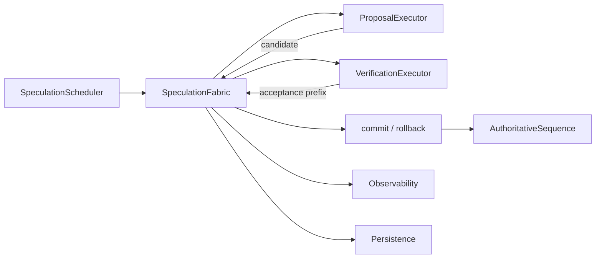
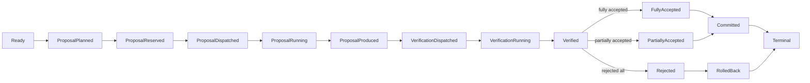

# Speculation Fabric

Speculation Fabric is an open-source, vendor-neutral runtime for governing
speculative inference: draft generation, candidate branching, verification,
token acceptance, rollback, model-pair compatibility, and authoritative
commit across heterogeneous AI serving infrastructure.

Its governing systems question is:

> How should speculative generation be proposed, verified, accepted, rejected,
> rolled back, and accounted for so that inference can exploit parallel
> candidate work without sacrificing correctness, authority, fairness, memory
> discipline, or deterministic recovery?

Speculation Fabric is **not** a toy speculative-decoding demo, a sampling
script, a benchmark shell, a thin CUDA wrapper, a generic scheduler, or a
model-specific plugin. It is the runtime boundary for speculative execution
inside inference serving.

The **authoritative sequence is the source of truth.** Speculative branches may
explore ahead, but no speculative output becomes authoritative merely because
it was generated. Only valid, authoritative verification may commit speculative
progress. Rejected, stale, duplicate, mismatched, superseded, or unauthorized
speculative work is never allowed to mutate authoritative sequence state.

## What this repository contains

- A typed C++20 public API: `SpeculationFabric`, `SpeculationScheduler`,
  `SpeculationRequest`, `AuthoritativeSequence`, `Proposal`, `CandidateSequence`,
  `Branch`, `ModelPair`, `ModelPairCompatibilityKey`,
  `ModelPairCompatibilityDecision`, `ProposalPlan`, `VerificationPlan`,
  `ProposalDispatch`, `VerificationDispatch`, `AcceptanceResult`, `CommitResult`,
  `RollbackResult`, `Reservation`, `WorkerDescriptor`, `DeviceDescriptor`,
  `StateDescriptor`, `ProposalExecutor`, `VerificationExecutor`, `Clock`,
  `Persistence`, `Explain`, `Snapshot`, `Stats`, `Event`, `Result<T>`,
  `Result<void>`, and a structured `ErrorCode`.
- A guarded speculative-lifecycle state machine.
- Deterministic CPU proposer and verifier executors.
- A CUDA proposer and verifier backend with real device kernels (optional).
- A framed TCP distributed control plane and worker model.
- Versioned, checksummed persistence and recovery.
- Policy, adaptive depth, backpressure, and fairness controls.
- Observability (`Snapshot`, `Stats`, event history, and explainability).
- A command-line tool (`sf`) and runnable examples.
- Unit, property, adversarial, concurrency, persistence, wire, and CUDA tests.

## Toolchain

- C++20, Windows x64, Visual Studio 2022 / current MSVC.
- CMake and Ninja.
- CUDA 13.1 on NVIDIA GeForce RTX 5090 (Blackwell, `sm_120`) is an optional
  backend. The CPU path is fully functional without CUDA.
- The library builds with `/W4 /WX`, zero warnings in Release and Debug.

CUDA is one proven backend, not an assumption embedded in the type system.
The runtime is vendor-neutral; no inference framework is part of its semantic
definition.

## Building

```powershell
# CPU-only Release
cmake -G Ninja -DCMAKE_BUILD_TYPE=Release -DSF_ENABLE_CUDA=OFF ..
cmake --build .

# With CUDA (Visual Studio generator is the supported path for MSVC + nvcc)
cmake -G "Visual Studio 17 2022" -A x64 -DSF_ENABLE_CUDA=ON ..
cmake --build . --config Release
```

Run the test suite with `ctest -C Release`.

## Using as a downstream dependency

Install and export the package, then consume it from an external project:

```cmake
find_package(SpeculationFabric CONFIG REQUIRED)
target_link_libraries(my_app PRIVATE SpeculationFabric::SpeculationFabric)
```

The repository ships an external consumer proof under `tests/consumer` that
performs exactly this and exercises real public API behavior.

## Architecture





## Semantic highlights

- **Proposal.** A final, immutable candidate with full provenance (authoritative
  base generation, state/KV generation, proposer, branch, candidate depth, and
  dispatch authority). A proposal is never mutated once it becomes eligible for
  verification.
- **Branching.** Multiple independent candidate branches from one authoritative
  point. Each branch has its own identity, lineage, and reservation; branches
  never collapse into one shared mutable candidate object. Losing branches are
  retired and can never commit.
- **Verification.** Verification is authoritative. A verifier receives the
  authority envelope and candidate, and returns per-position acceptance so the
  runtime can determine the accepted prefix, first rejection point, full
  acceptance, full rejection, retryability, and the authoritative next state.
- **Acceptance and rollback.** A partial acceptance commits exactly the
  accepted prefix (for example, proposal `A B C D E` accepting `A B C`
  advances authoritative state exactly three steps) and rejects `D E`. A full
  rejection commits nothing. Rejected suffixes are never authoritative.
- **Model-pair compatibility.** A pair is never treated as valid merely because
  two model names are supplied. Compatibility is a typed, deterministic decision
  that considers tokenizer/vocabulary identity, token interpretation, adapter
  stacks, executor/device constraints, candidate protocol version, state layout,
  and operator policy. Tokenizer/vocabulary mismatch is a correctness rejection.
- **Adaptive depth.** The proposal depth can vary with recent acceptance
  history, verifier saturation, memory headroom, deadline pressure, and policy.
  A fixed-policy mode supports reproducible testing.
- **Fairness and backpressure.** Speculative work is governed by per-tenant
  budgets, weighted service accounting, branch caps, proposer/verifier
  accounting, and deterministic tie-breaking, and it is deferred or disabled
  with structured reasons rather than silently dropped.
- **Memory and state governance.** Speculative state is reserved, owned,
  committed, or released explicitly. Reservations never underflow, are never
  double-released, and no speculative state leaks at closure.
- **Persistence and recovery.** Authoritative state is persisted in a
  versioned, checksummed, deterministic binary format. Recovery reconciles
  formerly in-flight work conservatively and never treats pre-crash remote work
  as automatically authoritative.
- **Distributed control plane.** A framed TCP protocol (fixed-width frame
  length, hard maximum frame size, protocol version, binary 64-bit identities)
  carries proposals and verifications between coordinator and worker processes.
  Every message carries enough authority (coordinator epoch, worker boot id,
  request, attempt, sequence, proposal and verification generation, and
  authoritative base generation) to reject stale work.

## CLI

```
sf submit --depth 5 --aligned 5 --id 100
sf status --depth 5
sf explain --depth 5
```

## Test and proof highlights

The test suite proves real proposal generation, real verification, full and
partial acceptance, rejected-suffix rollback, multi-branch behavior,
cancellation, retry, incompatible-pair rejection, persistence round-trips and
rejection of corruption/truncation/unknown versions, framed-protocol validation,
and CUDA proposer/verifier cross-validation against the CPU reference on an
RTX 5090.

See `docs/validation.md` for the exact validation matrix and
`docs/limitations.md` for the known limitations of this implementation.

## Documentation

- `docs/architecture.md` - architecture and invariants
- `docs/lifecycle.md` - the speculative lifecycle
- `docs/proposal_verification.md` - proposal and verification semantics
- `docs/compatibility.md` - model-pair compatibility
- `docs/persistence_format.md` - the persistence binary format
- `docs/protocol.md` - the framed wire protocol
- `docs/validation.md` - the validation matrix
- `docs/benchmarks.md` - benchmark methodology
- `docs/limitations.md` - actual, proven limitations

## License

Apache License 2.0. Copyright 2026 Summon Software Labs. No telemetry transmission.